# Documentation for Coupon Analysis

## Introduction

We have one dataset `/data/coupons.csv`.

- Data Analysis and Data Quality Assessment

## Data Analysis and Data Quality Assessment

- We are provided with 26 columns, of which only 8 columns are numeric and remaining 18 of them are object data types
- All the numeric fields have data
- Fields that have null values are `car`, `Bar`, `CoffeeHouse`, `CarryAway`, `RestaurantLessThan20`,
  `Restaurant20To50`.
- Simply Occupation into four groups: Umemployed, Student, Retired, Employed

### Fields not considered

- Car: Almost of rows are missing for car (with values like Scooter and Motorcycle, crosover, etc).

### Distribution of values in fields

- 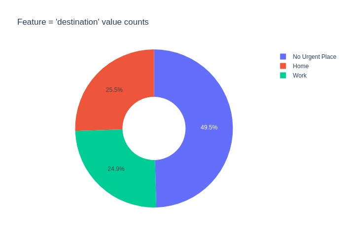
- 
- 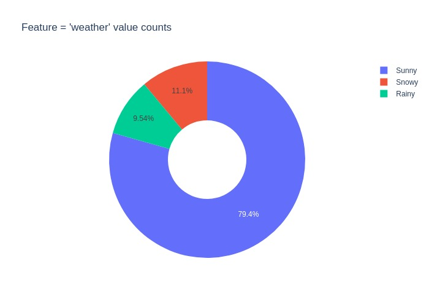
- 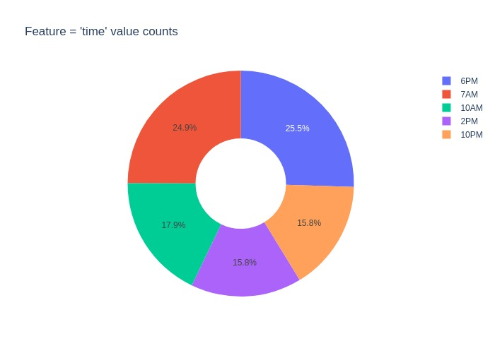
- 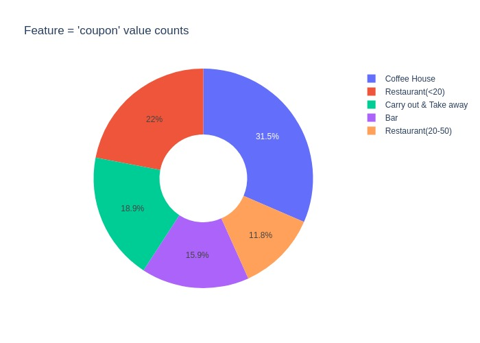
- 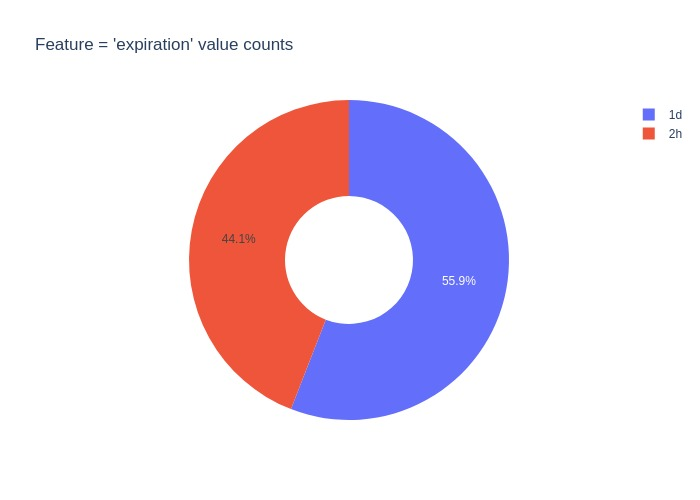
- 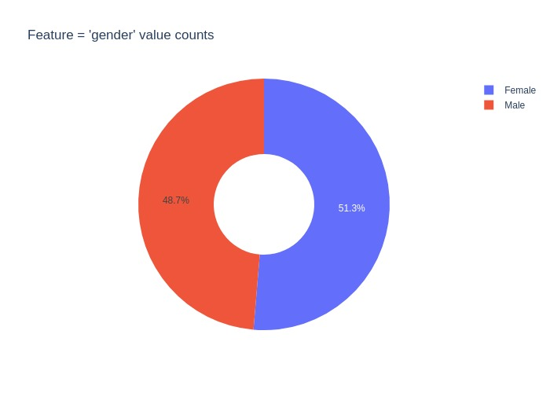
- 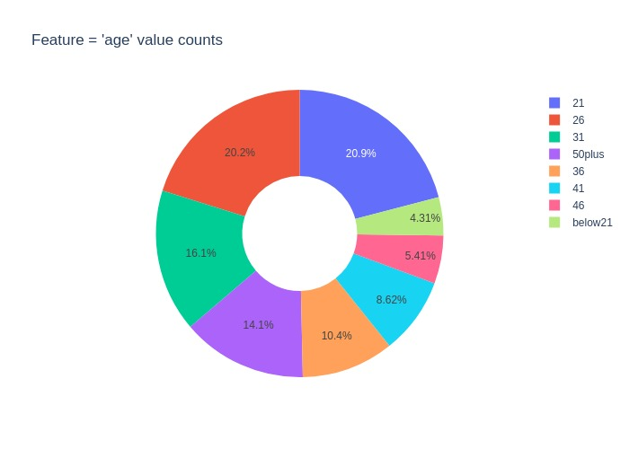
- 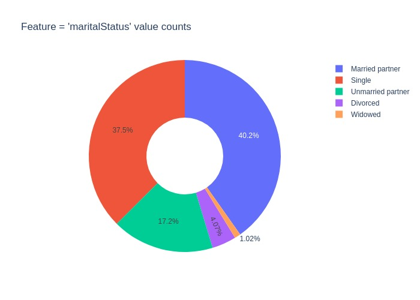
- 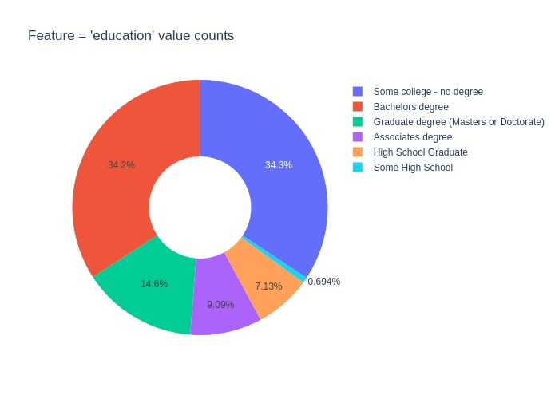
- 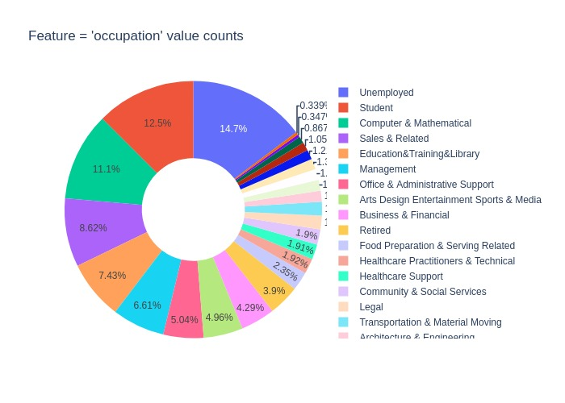
- 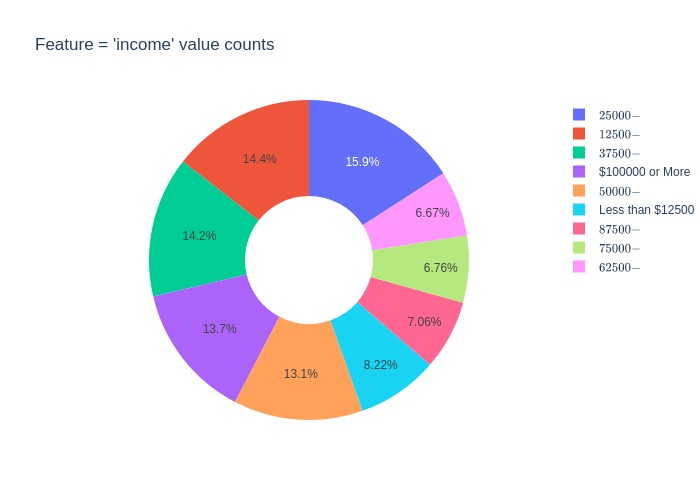
- 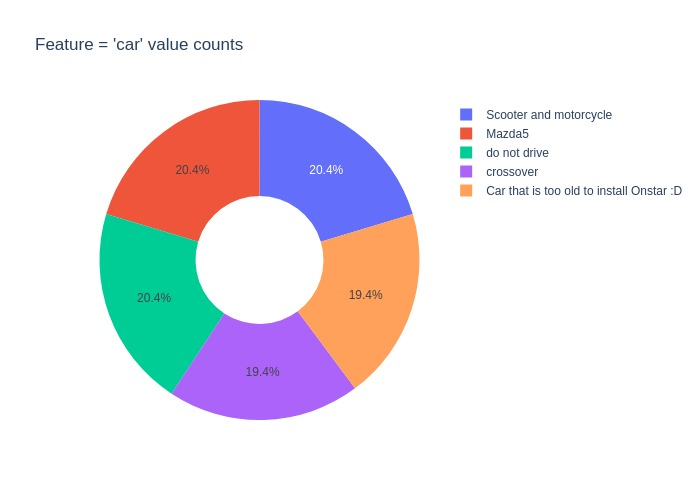
- 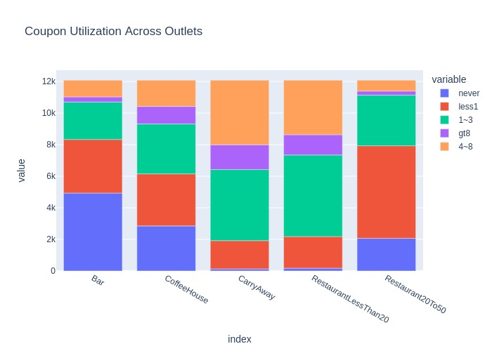

After cleaning up occupation
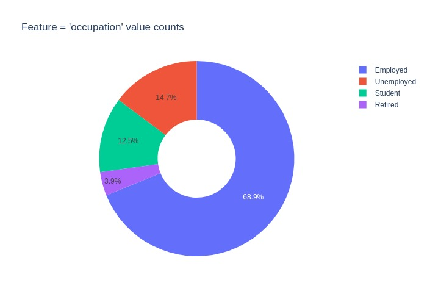

## Answers

### Proportion of total observations chose to accept the coupon

`56.84%` accept the coupons

```python
round(data['Y'].value_counts()[1.0]/data['Y'].count() * 100, 2)
```

### Bar plot to visualize the coupon column

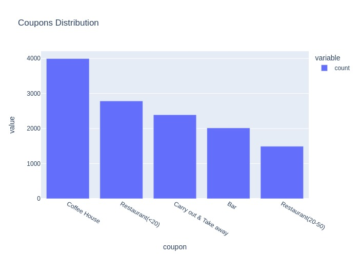

### Histogram to visualize the Temperature column

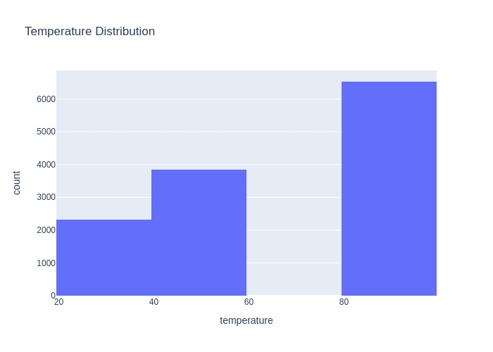

### What proportion of bar coupons were accepted

`0.82 %` is accepted.

Process:

- Get only the 'coupon' == 'Bar' and 'Y' == 1 for numerator
- Get 'coupon' == 'Bar' for denominator

### Accepetance Rate of those who went to bar 3 or few times a month

`63.3 %`

Three of fewer times are: `1~3` = 247
Then all other items except for `never` = 406

````python
tdf = accepted_bar_df['Bar'].value_counts()

three_or_fewer = tdf['1~3'] #+ tdf['less1']
more_times = tdf.sum() - three_or_fewer - tdf['never']

print(three_or_fewer)
print(more_times)
print('ratio: ', round(100 * (three_or_fewer / more_times) , 2))```
````

### Compare the acceptance rate between drivers who go to a bar more than once a month and are over the age of 25 to the all others. Is there a difference?

`159.57%`

We get split the data into two sets. One set with 25 years and above. Second set under 25 years. We get value counts of 'Bar' column but remove `never`. Get the count of both the sets and find the ratio.

`62.11%` - if we compare this ratio to all the bar visits (other than ones marked with never)

`36.28%` - if we compare to all the entires which a visit Y=1 across all food places

```python
ages_above_25 = ['26', '31', '50plus', '36', '41', '46']
df_25_above = accepted_bar_df.query('age in @ages_above_25 and Bar  not in ["never"]')
df_25_above['Bar'].value_counts()

tdf = df_25_above.query('Bar not in ["never"]')
tdf['Bar'].value_counts()

driver_who_go_bar_more_than_once = df_25_above.query('Bar not in ["less1"]').shape[0]
# print(driver_who_go_bar_more_than_once)


df_25_less = accepted_bar_df.query('age not in @ages_above_25 and Bar  not in ["never"]')
less_than_25_bar_goers = df_25_less['Bar'].shape[0]
```

### The acceptance rate between drivers who go to bars more than once a month and had passengers that were not a kid and had occupations other than farming, fishing, or forestry.

Ration in %: `3.58%`

1. Count the number of rows where Y='1', Bar is not in ('less1', 'never')
2. Across full dataset where passenger not Kid(s) and accupation is not in farming, fishing and forestry
